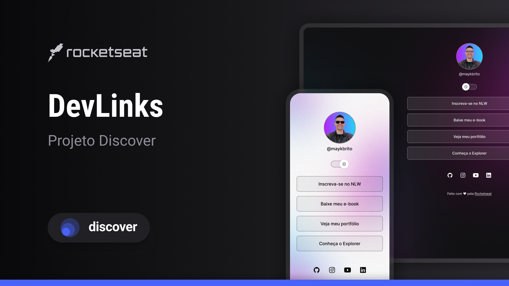

<h1 aling="center"> DevLink </h1>

Evendo exclusivo e gratuito, promovido pela Rocketseat para ensino de tecnologias WEB.

  <a href="#-tecnologias"> Tecnologias</a> &nbsp;&nbsp;&nbsp; |&nbsp;&nbsp;&nbsp;
  <a href="#-projeto">Projeto</a> &nbsp;&nbsp;&nbsp;| &nbsp;&nbsp;&nbsp;
  <a href="#-layout">Layout </a> &nbsp;&nbsp;&nbsp;|&nbsp;&nbsp;&nbsp;
  <a href="#memo-licença">Licença </a>

  

 

## 🚀 Tecnologias

Esse projeto foi desenvolvido com as seguintes tecnologias:

- HTML e CSS
- JavaScript
- Git e Github
- Figma

## Projeto

O DevLink é um agregador de links para usar como cartão de visitas online.

## Layout

Você pode visualizar o layout do projeto através [DESSE LINK](<https://www.figma.com/file/MF894TdzM99Fg9Ssu4KyMq/DevLinks-(Copy)?node-id=1%3A113&t=8x9407ecTa(MC2CS-1/duplicate)>). É necessário ter conta no [Figma](https://figma.com) para acessá-lo.

## :memo: Licença

Esse projeto está sob a licença MIT
